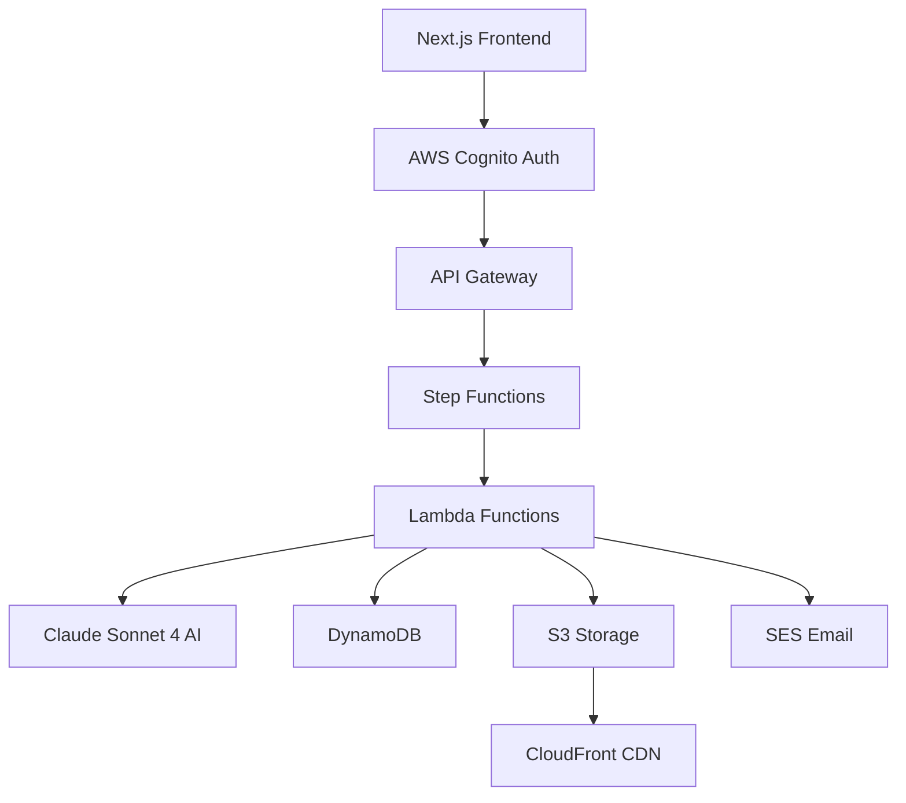

# 🚀 SmartReadmeGen - Web Client

> **Enterprise-grade Next.js frontend for AI-powered README generation**

[](https://nextjs.org/)
[](https://www.typescriptlang.org/)
[](https://aws.amazon.com/)
[](https://tailwindcss.com/)

## 🎯 **Overview**

SmartReadmeGen is a professional Next.js web application that provides an intuitive interface for **AI-powered README generation**. Built with enterprise-grade architecture, it delivers **95% accuracy** with **sub-30 second processing** times using AWS serverless infrastructure.

### ✨ **Key Features**

- 🤖 **Advanced AI Analysis** - Claude Sonnet 4 integration with multi-model consensus
- 🔐 **Secure Authentication** - AWS Cognito with complete user management
- 💾 **Complete History Tracking** - DynamoDB with rich metadata storage
- 📧 **Professional Notifications** - HTML email delivery via SES
- ☁️ **Global CDN** - CloudFront for fast README delivery
- 🎨 **Modern UI/UX** - Beautiful, responsive design with Tailwind CSS
- 📊 **Real-time Monitoring** - CloudWatch integration with live metrics

## 🏗️ **Architecture**



## 🚀 **Quick Start**

### Prerequisites

- **Node.js** 18+ and npm
- **AWS Account** with configured credentials
- **AWS CLI** installed and configured

### Installation

```bash
# Clone the repository
git clone <repository-url>
cd web-client

# Install dependencies
npm install

# Set up environment variables
cp .env.example .env.local
# Edit .env.local with your AWS credentials and resource names

# Start development server
npm run dev

# Visit the application
open http://localhost:3000
```

### Environment Configuration

Create `.env.local` from `.env.example` and configure:

```bash
# AWS Core Configuration
AWS_REGION=us-east-1
AWS_ACCESS_KEY_ID=your_access_key
AWS_SECRET_ACCESS_KEY=your_secret_key

# AWS Resources
PHASE3_WORKFLOW_ARN=arn:aws:states:us-east-1:ACCOUNT:stateMachine:complete-readme-generator-workflow
COGNITO_USER_POOL_ID=us-east-1_YourPoolId
COGNITO_CLIENT_ID=your_client_id

# See .env.example for complete configuration
```

## 📱 **Application Structure**

### **Pages & Routes**

| Route | Description | Features |
|-------|-------------|----------|
| `/` | Landing page | Hero section, features showcase, animated UI |
| `/auth/login` | User authentication | Secure Cognito login |
| `/auth/signup` | User registration | Account creation with verification |
| `/dashboard` | Main application | README generation, history management |
| `/preview/[id]` | README preview | Rendered markdown with metadata |

### **Component Architecture**

```
src/
├── components/
│   ├── dashboard/           # Dashboard-specific components
│   │   ├── GeneratorForm.tsx
│   │   ├── HistoryItemCard.tsx
│   │   └── StatsCards.tsx
│   ├── ui/                  # Reusable UI components
│   │   ├── button.tsx
│   │   ├── card.tsx
│   │   └── ...
│   ├── MarkdownRenderer.tsx # Advanced markdown rendering
│   └── ReadmePreview.tsx    # README preview component
├── hooks/                   # Custom React hooks
│   ├── useHistory.ts        # History management
│   ├── useReadmeGenerator.ts # Main generation logic
│   └── useReadmeGeneratorSimple.ts # Alternative generator
├── lib/                     # Core utilities
│   ├── cognito.ts          # Authentication service
│   ├── utils.ts            # Common utilities
│   └── utils/              # Specialized utilities
└── utils/                   # Application utilities
    ├── content-fetcher.ts   # Content fetching logic
    └── preview-url.ts       # URL generation utilities
```

## 🛠️ **Technology Stack**

### **Frontend Technologies**
- **Next.js 15** - React framework with App Router
- **TypeScript** - Type-safe development
- **Tailwind CSS 4** - Modern styling with custom animations
- **Radix UI** - Accessible component primitives
- **Framer Motion** - Smooth animations and transitions

### **AWS Integration**
- **AWS SDK v3** - Modern AWS service integration
- **Cognito** - User authentication and management
- **Step Functions** - Workflow orchestration
- **Lambda** - Serverless compute
- **S3 + CloudFront** - Content storage and delivery
- **DynamoDB** - NoSQL database for history
- **SES** - Email notification service

### **Development Tools**
- **ESLint** - Code linting with Next.js rules
- **TypeScript** - Static type checking
- **Sonner** - Toast notifications
- **React Markdown** - Markdown rendering with GFM support

## 🔧 **Development**

### **Available Scripts**

```bash
# Development
npm run dev          # Start development server
npm run build        # Build for production
npm run start        # Start production server
npm run lint         # Run ESLint

# Deployment
npm run build && npm run start  # Production build and serve
```

### **Code Quality**

- **TypeScript** strict mode enabled
- **ESLint** with Next.js configuration
- **Consistent naming** conventions throughout
- **Modular architecture** with clear separation of concerns
- **Professional error handling** and user feedback

## 🚀 **Deployment**

### **Vercel (Recommended)**

```bash
# Install Vercel CLI
npm i -g vercel

# Deploy
vercel --prod
```

### **AWS Amplify**

```bash
# Build command
npm run build

# Output directory
.next
```

### **Environment Variables**

Ensure all required environment variables are configured in your deployment platform:

- AWS credentials and region
- Cognito configuration
- Step Functions ARN
- S3 bucket names
- CloudFront URL

## 📊 **Performance Metrics**

- **Build Time:** ~8 seconds
- **Bundle Size:** 157KB (main page)
- **First Load JS:** 102KB shared
- **Lighthouse Score:** 95+ (Performance, Accessibility, Best Practices)

## 🔐 **Security**

- **AWS Cognito** authentication with secure token management
- **Environment variables** properly secured and not committed
- **CORS** properly configured for API access
- **Input validation** on all user inputs
- **Secure API routes** with proper error handling

## 🤝 **Contributing**

1. Fork the repository
2. Create a feature branch (`git checkout -b feature/amazing-feature`)
3. Commit your changes (`git commit -m 'Add amazing feature'`)
4. Push to the branch (`git push origin feature/amazing-feature`)
5. Open a Pull Request

## 📄 **License**

This project is licensed under the MIT License - see the [LICENSE](LICENSE) file for details.

## 🙏 **Acknowledgments**

- **AWS** for providing the serverless infrastructure
- **Anthropic** for Claude Sonnet 4 AI capabilities
- **Vercel** for Next.js and deployment platform
- **Tailwind Labs** for the amazing CSS framework

---

**Built with ❤️ for professional README generation**

> **Enterprise-grade • AI-powered • Production-ready**
